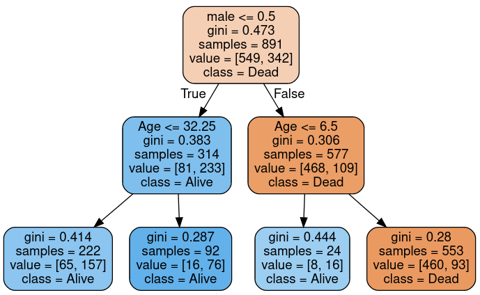

# kaggle-notebooks

Notebooks used in kaggle competitions and datasets: EDA and predictions.

In order to run them locally you need to have jupyter installed, and also to
create an directory called `input` and copy the needed datasets.

## Titanic competition notebooks

Notebooks with work on [Kaggle's Titanic competition](https://www.kaggle.com/c/titanic).

[The notebooks ](https://github.com/liopic/kaggle-notebooks/tree/master/titanic)
needs both [train and test csv files](https://www.kaggle.com/c/titanic/data) in
the `input` directory.

- **Simple prediction with just age and sex features** : Using just age and
sex features, a simple EDA is presented, as well as a prediction with a Tree
Classifier with a diagram of the tree.

- **How to create new features and use AdaBoostClassifier** : Detailed feature
engineering and prediction with AdaBoostClassifier.

## Star Wars dialogues

Notebook with exploration on [Star Wars scripts](https://www.kaggle.com/datasets/xvivancos/star-wars-movie-scripts)

[The notebook](https://github.com/liopic/kaggle-notebooks/tree/master/star-wars)
needs the file `SW_EpisodeIV.txt` in the `input` directory.

- **NLP with Star Wars dialogues**: Analyzes the words used by each movie
character as well as factions from Star Wars Ep.IV.
